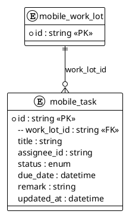
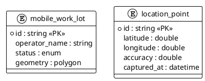
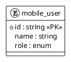

# 数据结构（Mobile 端）

## 1. 领域实体模块划分

| 模块名称 | 领域实体 | 数据库表 | 说明 |
| :--- | :--- | :--- | :--- |
| **任务执行模块** | MobileTaskDO | mobile_task | 现场任务列表与状态更新 |
| **地图与 GPS 模块** | MobileWorkLotDO LocationPointDO | mobile_work_lot location_point | 现场地图显示与定位信息 |
| **用户模块** | MobileUserDO | mobile_user | 当前用户与角色信息 |

## 2. 各模块实体详细属性

### 2.1 任务执行模块

#### MobileTaskDO（移动端任务）

| 属性名称 | 类型 | 数据库字段 | 说明 |
| :--- | :--- | :--- | :--- |
| id | String | id | 主键 |
| workLotId | String | work_lot_id | 关联 Work Lot |
| title | String | title | 任务标题 |
| assigneeId | String | assignee_id | 负责人 |
| status | Enum | status | 任务状态（进行中/已完成） |
| dueDate | DateTime | due_date | 截止时间 |
| remark | String | remark | 现场备注（可选） |
| updatedAt | DateTime | updated_at | 更新时间 |

### 2.2 地图与 GPS 模块

#### MobileWorkLotDO（移动端 Work Lot 视图）

| 属性名称 | 类型 | 数据库字段 | 说明 |
| :--- | :--- | :--- | :--- |
| id | String | id | 主键 |
| operatorName | String | operator_name | 经营者名称 |
| status | Enum | status | 状态（用于颜色渲染） |
| geometry | Polygon | geometry | 运营范围面（HK80） |

#### LocationPointDO（定位点）

| 属性名称 | 类型 | 数据库字段 | 说明 |
| :--- | :--- | :--- | :--- |
| id | String | id | 主键 |
| latitude | Double | latitude | 纬度 |
| longitude | Double | longitude | 经度 |
| accuracy | Double | accuracy | 定位精度（米） |
| capturedAt | DateTime | captured_at | 采集时间 |

### 2.3 用户模块

#### MobileUserDO（移动端用户）

| 属性名称 | 类型 | 数据库字段 | 说明 |
| :--- | :--- | :--- | :--- |
| id | String | id | 主键 |
| name | String | name | 用户名 |
| role | Enum | role | 角色（Field Staff） |
