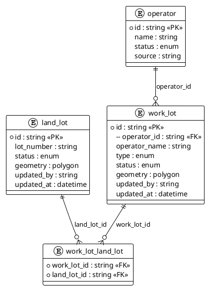
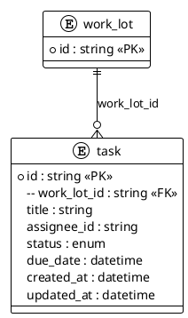
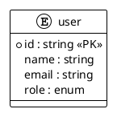

# 数据结构（Web 端）

## 1. 领域实体模块划分

| 模块名称 | 领域实体 | 数据库表 | 说明 |
| :--- | :--- | :--- | :--- |
| **地块管理模块** | LandLotDO OperatorDO WorkLotDO WorkLotLandLotLink | land_lot operator work_lot work_lot_land_lot | 维护法律地界、经营者与运营范围关系 |
| **任务管理模块** | TaskDO | task | 任务创建、分配与状态追踪 |
| **用户与权限模块** | UserDO | user | 用户信息与角色权限 |

## 2. 各模块实体详细属性

### 2.1 地块管理模块

#### LandLotDO（法律地界）

| 属性名称 | 类型 | 数据库字段 | 说明 |
| :--- | :--- | :--- | :--- |
| id | String | id | 主键 |
| lotNumber | String | lot_number | 地段编号 |
| status | Enum | status | 地界状态 |
| geometry | Polygon | geometry | 地界面（HK80） |
| updatedBy | String | updated_by | 最后更新人 |
| updatedAt | DateTime | updated_at | 最后更新时间 |

#### OperatorDO（经营者主体）

| 属性名称 | 类型 | 数据库字段 | 说明 |
| :--- | :--- | :--- | :--- |
| id | String | id | 主键 |
| name | String | name | 经营者名称 |
| status | Enum | status | 经营者状态 |
| source | String | source | 来源（清册/调查/登记） |

#### WorkLotDO（运营范围）

| 属性名称 | 类型 | 数据库字段 | 说明 |
| :--- | :--- | :--- | :--- |
| id | String | id | 主键 |
| operatorId | String | operator_id | 关联经营者 |
| operatorName | String | operator_name | 经营者名称（冗余展示） |
| type | Enum | type | 类型（如：核对/交接/清场等） |
| status | Enum | status | 当前状态 |
| geometry | Polygon | geometry | 运营范围面（HK80） |
| updatedBy | String | updated_by | 最后更新人 |
| updatedAt | DateTime | updated_at | 最后更新时间 |

#### WorkLotLandLotLink（关联关系）

| 属性名称 | 类型 | 数据库字段 | 说明 |
| :--- | :--- | :--- | :--- |
| workLotId | String | work_lot_id | Work Lot ID |
| landLotId | String | land_lot_id | Land Lot ID |

### 2.2 任务管理模块

#### TaskDO（任务）

| 属性名称 | 类型 | 数据库字段 | 说明 |
| :--- | :--- | :--- | :--- |
| id | String | id | 主键 |
| workLotId | String | work_lot_id | 关联 Work Lot |
| title | String | title | 任务标题 |
| assigneeId | String | assignee_id | 负责人 |
| status | Enum | status | 任务状态 |
| dueDate | DateTime | due_date | 截止时间 |
| createdAt | DateTime | created_at | 创建时间 |
| updatedAt | DateTime | updated_at | 更新时间 |

### 2.3 用户与权限模块

#### UserDO（用户）

| 属性名称 | 类型 | 数据库字段 | 说明 |
| :--- | :--- | :--- | :--- |
| id | String | id | 主键 |
| name | String | name | 用户名 |
| email | String | email | 邮箱 |
| role | Enum | role | 角色（Site Admin / Site Officer / Field Staff） |
