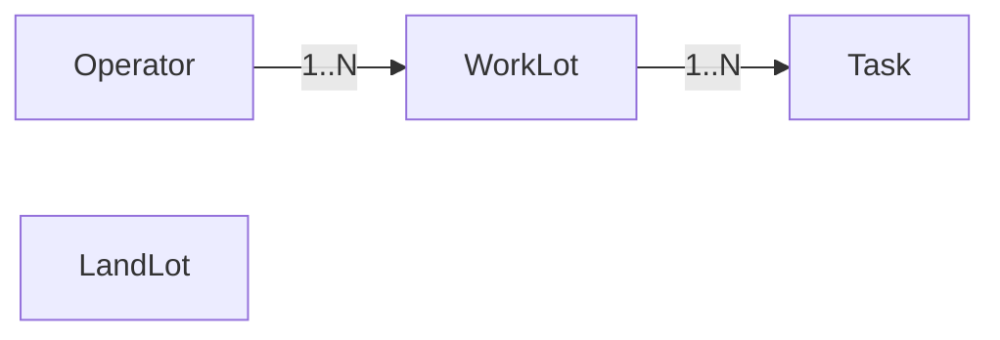

# 用户故事与验收

## 用户角色口径
| 角色 | 说明 |
| --- | --- |
| Site Admin（系统管理员/测量/IT） | 维护 Land Lot 数据、系统配置与权限 |
| Site Officer（现场主任/前线管理） | 维护 Work Lot、创建与分配任务、追踪进度 |
| Field Staff（现场执行） | 执行任务、GPS 核验、更新任务状态 |

## US 索引（模块级）
| 模块 | US 范围 | 说明 |
| --- | --- | --- |
| Web-地图与 GIS | US-001 ~ US-006 | 底图、标注、图层与对比视图 |
| Web-Land Lot 管理 | US-007 ~ US-011 | 参考层维护与属性管理 |
| Web-Work Lot 管理 | US-012 ~ US-018 | 运营范围绘制、吸附与状态颜色 |
| Web-任务管理 | US-019 ~ US-026 | 创建、分配、列表、状态与预警 |
| Web-报表与查询 | US-027 ~ US-032 | 列表、点击/框选查询、搜索与导出 |
| Web-用户与权限 | US-033 ~ US-035 | 角色切换与权限控制 |
| Mobile-地图与导航 | US-036 ~ US-038 | 底图、交互与 Work Lot 图层 |
| Mobile-任务与 GPS | US-039 ~ US-044 | 任务查看/更新与 GPS 核验 |

## 核心实体与关系

### 实体定义
| 实体 | 定义 | 维护角色 | 备注 |
| --- | --- | --- | --- |
| LandLot | 法律地界参考层 | Site Admin | 通常预置或由管理员维护 |
| Operator | 受影响经营者主体 | Site Admin | 来自清册/调查，可预置 |
| WorkLot | Operator 实际占用/作业范围 | Site Officer | 现场绘制/维护 |
| Task | 挂在 WorkLot 上的执行事项 | Site Admin / Site Officer | Field Staff 只读/更新状态 |

### 关系定义
- Operator 1:N WorkLot
- WorkLot 1:N Task
- LandLot 为独立参考层（不与 WorkLot 建立数据关联）

## 全局规则与验收

:::tabs key:global
== 全局业务规则（GR）

| GR ID | 规则 |
| --- | --- |
| GR-01 | GIS 坐标系统一为 HK80（EPSG:2326）。 |
| GR-02 | 任务状态枚举：待处理/进行中/已完成/已逾期；逾期 = 当前时间 > 截止时间且状态未完成。 |
| GR-03 | 颜色预警：逾期=红、进行中=黄、已完成=绿；待处理使用系统默认颜色。 |
| GR-04 | 权限矩阵遵循《角色与权限》，仅允许角色对应的创建/编辑/删除操作。 |
| GR-05 | Demo 阶段数据需在刷新后保持（本地持久化）。 |
| GR-06 | Task 必须关联一个 Work Lot；Land Lot 与 Work Lot 不建立数据关联，仅做图层叠加对照。 |

== 通用验收要点（GA）

| GA ID | 验收要点 |
| --- | --- |
| GA-01 | 权限类操作（创建/编辑/删除/导出/管理）必须可见性与实际能力一致（隐藏或禁用）。 |
| GA-02 | 必填字段缺失时禁止保存，并提示原因。 |
| GA-03 | 关键状态变化需同步到列表、详情与地图渲染（如颜色变化）。 |
| GA-04 | 刷新页面后数据仍可恢复（Demo 持久化）。 |

:::

## 一、Web Portal（管理端）

### 1.1 地图与 GIS

#### US-001
作为所有角色，我希望 Web 端默认加载 CSDI 官方底图，从而在权威底图上进行地块管理。

:::tabs key:us
== 业务规则

| BR ID | 规则 |
| --- | --- |
| BR-001-1 | Web 端默认加载 CSDI Topographic Map API（HK80，zoom 10-20）。 |
| BR-001-2 | 地图界面必须显示 CSDI/LandsD 署名与版权信息。 |

== 验收标准

| AC ID | Given | When | Then |
| --- | --- | --- | --- |
| AC-001-1 | 用户进入地图页 | 页面加载完成 | 显示 CSDI Topographic 底图 |
| AC-001-2 | 当前缩放在 10-20 级 | 用户缩放地图 | 瓦片正常加载，无空白 |
| AC-001-3 | 地图已加载 | 用户查看地图界面 | 署名/版权信息可见 |

:::

#### US-002
作为所有角色，我希望可开关地名标注图层，从而在需要时查看地名信息。

:::tabs key:us
== 业务规则

| BR ID | 规则 |
| --- | --- |
| BR-002-1 | 标注图层使用 CSDI Map Label API（HK80，zoom 8-20）。 |
| BR-002-2 | 标注图层支持语言切换（tc/en/sc）。 |

== 验收标准

| AC ID | Given | When | Then |
| --- | --- | --- | --- |
| AC-002-1 | 标注图层关闭 | 用户开启标注图层 | 地名标注显示 |
| AC-002-2 | 标注图层开启 | 用户关闭标注图层 | 地名标注消失 |
| AC-002-3 | 标注图层开启 | 用户切换语言 | 标注语言随之更新 |

:::

#### US-003
作为所有角色，我希望地图支持缩放、平移与基础定位，从而自由浏览地块。

:::tabs key:us
== 业务规则

| BR ID | 规则 |
| --- | --- |
| BR-003-1 | 地图必须支持缩放（按钮/滚轮）与拖拽平移。 |
| BR-003-2 | 地图需提供搜索/定位入口（规则见 US-031）。 |

== 验收标准

| AC ID | Given | When | Then |
| --- | --- | --- | --- |
| AC-003-1 | 地图已加载 | 用户拖拽地图 | 地图中心位置发生变化 |
| AC-003-2 | 地图已加载 | 用户缩放地图 | 比例尺变化且瓦片更新 |
| AC-003-3 | 地图已加载 | 用户查看界面 | 存在搜索/定位入口 |

:::

#### US-004
作为所有角色，我希望可以切换不同底图样式，从而在不同场景下查看地块。

:::tabs key:us
== 业务规则

| BR ID | 规则 |
| --- | --- |
| BR-004-1 | 底图至少支持街道/地形/卫星三种样式切换。 |
| BR-004-2 | 切换底图时保持当前视角与缩放级别。 |

== 验收标准

| AC ID | Given | When | Then |
| --- | --- | --- | --- |
| AC-004-1 | 地图已加载 | 用户切换底图样式 | 底图样式变化且无空白 |
| AC-004-2 | 已显示业务图层 | 用户切换底图 | Land Lot/Work Lot 图层不受影响 |

:::

#### US-005
作为所有角色，我希望可以开关政府图层和自定义图层，从而专注查看当前需要的信息。

:::tabs key:us
== 业务规则

| BR ID | 规则 |
| --- | --- |
| BR-005-1 | 支持 Land Lot、Work Lot 及政府图层的可见性开关。 |
| BR-005-2 | 图层开关对当前用户会话生效。 |

== 验收标准

| AC ID | Given | When | Then |
| --- | --- | --- | --- |
| AC-005-1 | 图层已显示 | 用户关闭某图层 | 对应图形在地图中隐藏 |
| AC-005-2 | 图层已关闭 | 用户重新开启图层 | 对应图形重新显示 |

:::

#### US-006
作为所有角色，我希望可以同时对比多个图层，从而快速发现差异。

:::tabs key:us
== 业务规则

| BR ID | 规则 |
| --- | --- |
| BR-006-1 | 对比视图支持至少两个图层同时显示。 |
| BR-006-2 | 对比视图可随时切回普通显示模式。 |

== 验收标准

| AC ID | Given | When | Then |
| --- | --- | --- | --- |
| AC-006-1 | 地图已加载 | 用户进入对比视图 | 至少两个图层同时可见 |
| AC-006-2 | 已处于对比视图 | 用户退出对比视图 | 地图恢复普通模式 |

:::

### 1.2 Land Lot 管理

#### US-007
作为所有角色，我希望在地图上看到 Land Lot 边界，从而作为参考层。

:::tabs key:us
== 业务规则

| BR ID | 规则 |
| --- | --- |
| BR-007-1 | Land Lot 以参考层显示（蓝框/低透明度）。 |
| BR-007-2 | 所有角色可查看，但仅 Site Admin 可编辑。 |

== 验收标准

| AC ID | Given | When | Then |
| --- | --- | --- | --- |
| AC-007-1 | 系统存在 Land Lot 数据 | 地图加载完成 | Land Lot 边界可见 |
| AC-007-2 | 当前角色为 Site Officer/Field Staff | 用户查看工具栏 | 不显示 Land Lot 编辑入口 |

:::

#### US-008
作为 Site Admin，我希望可以绘制 Land Lot 多边形，从而维护法律地界数据。

:::tabs key:us
== 业务规则

| BR ID | 规则 |
| --- | --- |
| BR-008-1 | 仅 Site Admin 可使用 Land Lot 绘制工具。 |
| BR-008-2 | 创建时必须填写 lotNumber；几何遵循 GR-01。 |

== 验收标准

| AC ID | Given | When | Then |
| --- | --- | --- | --- |
| AC-008-1 | 角色为 Site Admin | 用户绘制并填写 lotNumber 保存 | Land Lot 显示在地图上 |
| AC-008-2 | 角色为 Site Admin | 用户未填写 lotNumber 保存 | 系统阻止保存并提示 |
| AC-008-3 | 已保存 Land Lot | 用户刷新页面 | 数据仍存在 |

:::

#### US-009
作为 Site Admin，我希望可以编辑 Land Lot 边界和属性，从而修正数据。

:::tabs key:us
== 业务规则

| BR ID | 规则 |
| --- | --- |
| BR-009-1 | 仅 Site Admin 可编辑 Land Lot。 |
| BR-009-2 | 编辑保存后更新 updatedBy/updatedAt。 |

== 验收标准

| AC ID | Given | When | Then |
| --- | --- | --- | --- |
| AC-009-1 | 角色为 Site Admin | 用户编辑边界并保存 | 地图图形即时更新 |
| AC-009-2 | 角色为 Site Admin | 用户修改属性并保存 | 详情/列表同步更新 |
| AC-009-3 | 角色非 Site Admin | 用户尝试编辑 | 系统阻止编辑 |

:::

#### US-010
作为 Site Admin，我希望可以删除错误的 Land Lot，从而保持数据准确。

:::tabs key:us
== 业务规则

| BR ID | 规则 |
| --- | --- |
| BR-010-1 | 仅 Site Admin 可删除 Land Lot。 |
| BR-010-2 | 删除前必须二次确认。 |

== 验收标准

| AC ID | Given | When | Then |
| --- | --- | --- | --- |
| AC-010-1 | 角色为 Site Admin | 用户确认删除 | Land Lot 从地图与列表移除 |
| AC-010-2 | 角色为 Site Admin | 用户取消删除 | Land Lot 保持不变 |

:::

#### US-011
作为所有角色，我希望查看 Land Lot 信息，从而了解地块基础数据。

:::tabs key:us
== 业务规则

| BR ID | 规则 |
| --- | --- |
| BR-011-1 | 信息字段包含 id、lotNumber、status、updatedBy、updatedAt。 |
| BR-011-2 | Site Admin 可编辑，其他角色只读。 |

== 验收标准

| AC ID | Given | When | Then |
| --- | --- | --- | --- |
| AC-011-1 | 地图存在 Land Lot | 用户点击 Land Lot | 显示上述字段 |
| AC-011-2 | 角色为 Site Admin | 用户修改字段并保存 | 信息更新成功 |

:::

### 1.3 Work Lot 管理

#### US-012
作为所有角色，我希望在地图上看到 Work Lot，从而了解现场占用范围。

:::tabs key:us
== 业务规则

| BR ID | 规则 |
| --- | --- |
| BR-012-1 | Work Lot 作为业务图层显示为彩色多边形。 |
| BR-012-2 | Work Lot 可点击查看详情。 |

== 验收标准

| AC ID | Given | When | Then |
| --- | --- | --- | --- |
| AC-012-1 | 系统存在 Work Lot 数据 | 地图加载完成 | Work Lot 边界可见 |
| AC-012-2 | 地图存在 Work Lot | 用户点击 Work Lot | 打开详情面板 |

:::

#### US-013
作为 Site Officer，我希望绘制 Work Lot 多边形，从而记录实际占用范围。

:::tabs key:us
== 业务规则

| BR ID | 规则 |
| --- | --- |
| BR-013-1 | 仅 Site Officer 可使用 Work Lot 绘制工具。 |
| BR-013-2 | 创建时必须填写 operatorName；几何遵循 GR-01。 |
| BR-013-3 | Work Lot 与 Land Lot 不建立数据关联，仅视觉叠图对照（GR-06）。 |

== 验收标准

| AC ID | Given | When | Then |
| --- | --- | --- | --- |
| AC-013-1 | 角色为 Site Officer | 用户绘制并填写 operatorName 保存 | Work Lot 显示在地图上 |
| AC-013-2 | 角色为 Site Officer | 用户未填写 operatorName 保存 | 系统阻止保存并提示 |
| AC-013-3 | 已保存 Work Lot | 用户刷新页面 | 数据仍存在 |

:::

#### US-014
作为 Site Officer，我希望可以编辑 Work Lot 边界和属性，从而与现场情况保持一致。

:::tabs key:us
== 业务规则

| BR ID | 规则 |
| --- | --- |
| BR-014-1 | 仅 Site Officer 可编辑 Work Lot。 |
| BR-014-2 | 不维护 Land Lot 关联关系（仅视觉叠图对照）。 |

== 验收标准

| AC ID | Given | When | Then |
| --- | --- | --- | --- |
| AC-014-1 | 角色为 Site Officer | 用户编辑边界并保存 | 地图图形即时更新 |
| AC-014-3 | 角色非 Site Officer | 用户尝试编辑 | 系统阻止编辑 |

:::

#### US-015
作为 Site Officer，我希望删除无效的 Work Lot，从而保持数据准确。

:::tabs key:us
== 业务规则

| BR ID | 规则 |
| --- | --- |
| BR-015-1 | 仅 Site Officer 可删除 Work Lot。 |
| BR-015-2 | 删除前必须二次确认。 |

== 验收标准

| AC ID | Given | When | Then |
| --- | --- | --- | --- |
| AC-015-1 | 角色为 Site Officer | 用户确认删除 | Work Lot 从地图与列表移除 |
| AC-015-2 | 角色为 Site Officer | 用户取消删除 | Work Lot 保持不变 |

:::

#### US-016
作为所有角色，我希望查看 Work Lot 信息，从而了解经营者与占用情况。

:::tabs key:us
== 业务规则

| BR ID | 规则 |
| --- | --- |
| BR-016-1 | 信息字段包含 id、operatorName、type、status、updatedBy、updatedAt。 |
| BR-016-2 | Site Officer 可编辑，其他角色只读。 |

== 验收标准

| AC ID | Given | When | Then |
| --- | --- | --- | --- |
| AC-016-1 | 地图存在 Work Lot | 用户点击 Work Lot | 显示上述字段 |
| AC-016-2 | 角色为 Site Officer | 用户修改字段并保存 | 信息更新成功 |

:::

#### US-017
作为 Site Officer，我希望绘制/编辑 Work Lot 时自动吸附到 Land Lot 边界，从而减少误差。

:::tabs key:us
== 业务规则

| BR ID | 规则 |
| --- | --- |
| BR-017-1 | Site Officer 绘制或编辑 Work Lot 时自动启用吸附。 |
| BR-017-2 | 吸附仅对 Land Lot 边界生效。 |

== 验收标准

| AC ID | Given | When | Then |
| --- | --- | --- | --- |
| AC-017-1 | 角色为 Site Officer | 绘制/编辑顶点靠近 Land Lot 边界 | 顶点自动贴合边界 |
| AC-017-2 | 角色非 Site Officer | 用户绘制/编辑 | 不出现吸附效果 |

:::

#### US-018
作为所有角色，我希望在地图上通过颜色快速识别 Work Lot 的任务状态，从而快速判断风险。

:::tabs key:us
== 业务规则

| BR ID | 规则 |
| --- | --- |
| BR-018-1 | 颜色映射遵循 GR-03。 |
| BR-018-2 | 多任务时按严重程度显示（逾期 > 进行中 > 待处理 > 已完成）。 |

== 验收标准

| AC ID | Given | When | Then |
| --- | --- | --- | --- |
| AC-018-1 | Work Lot 存在逾期任务 | 地图渲染 | Work Lot 显示红色 |
| AC-018-2 | Work Lot 仅有进行中任务 | 地图渲染 | Work Lot 显示黄色 |
| AC-018-3 | Work Lot 任务全部完成 | 地图渲染 | Work Lot 显示绿色 |

:::

### 1.4 任务管理

#### US-019
作为 Site Admin/Officer，我希望创建任务并关联 Work Lot，从而管理现场工作。

:::tabs key:us
== 业务规则

| BR ID | 规则 |
| --- | --- |
| BR-019-1 | 仅 Site Admin/Officer 可创建任务。 |
| BR-019-2 | 任务必须关联一个 Work Lot（GR-06）。 |
| BR-019-3 | 创建时必填 title 与 dueDate，status 默认为“待处理”。 |

== 验收标准

| AC ID | Given | When | Then |
| --- | --- | --- | --- |
| AC-019-1 | 角色为 Site Admin/Officer | 填写必填字段并保存 | 任务出现在列表与 Work Lot 详情 |
| AC-019-2 | 角色为 Site Admin/Officer | 缺少必填字段保存 | 系统阻止保存并提示 |

:::

#### US-020
作为 Site Admin/Officer，我希望为任务分配或变更负责人，从而明确执行人。

:::tabs key:us
== 业务规则

| BR ID | 规则 |
| --- | --- |
| BR-020-1 | 仅 Site Admin/Officer 可分配/变更负责人。 |
| BR-020-2 | 负责人必须为 Field Staff 用户。 |

== 验收标准

| AC ID | Given | When | Then |
| --- | --- | --- | --- |
| AC-020-1 | 角色为 Site Admin/Officer | 为任务分配 Field Staff | 任务详情显示新负责人 |
| AC-020-2 | 任务已分配 | Field Staff 查看移动端列表 | 任务出现在本人列表 |

:::

#### US-021
作为所有角色，我希望查看任务列表，从而了解任务总体情况。

:::tabs key:us
== 业务规则

| BR ID | 规则 |
| --- | --- |
| BR-021-1 | Site Admin/Officer 可查看全部任务；Field Staff 仅查看自己任务。 |
| BR-021-2 | 列表至少展示标题、关联 Work Lot、负责人、状态、截止时间。 |

== 验收标准

| AC ID | Given | When | Then |
| --- | --- | --- | --- |
| AC-021-1 | 角色为 Site Admin/Officer | 打开任务列表 | 显示全部任务 |
| AC-021-2 | 角色为 Field Staff | 打开任务列表 | 仅显示本人任务 |

:::

#### US-022
作为所有角色，我希望查看任务详情，从而了解任务要求和地块信息。

:::tabs key:us
== 业务规则

| BR ID | 规则 |
| --- | --- |
| BR-022-1 | 详情展示任务字段（title、assignee、status、dueDate、createdAt）与关联 Work Lot 信息。 |
| BR-022-2 | 支持从列表或地图入口进入详情。 |

== 验收标准

| AC ID | Given | When | Then |
| --- | --- | --- | --- |
| AC-022-1 | 任务存在 | 用户从列表/地图进入详情 | 任务详情页面打开 |
| AC-022-2 | 任务详情已打开 | 用户查看内容 | 显示关联 Work Lot 信息 |

:::

#### US-023
作为所有角色，我希望更新任务状态，从而实时反映进度。

:::tabs key:us
== 业务规则

| BR ID | 规则 |
| --- | --- |
| BR-023-1 | 任务状态枚举与逾期规则遵循 GR-02。 |
| BR-023-2 | Field Staff 仅可更新自己任务为“进行中/已完成”。 |
| BR-023-3 | Site Admin/Officer 可更新全部任务状态。 |

== 验收标准

| AC ID | Given | When | Then |
| --- | --- | --- | --- |
| AC-023-1 | Field Staff 处理本人任务 | 更新状态为进行中/已完成 | 列表与地图状态同步 |
| AC-023-2 | Field Staff 尝试更新他人任务 | 提交更新 | 系统阻止更新 |
| AC-023-3 | Site Admin/Officer 更新任一任务状态 | 提交更新 | 状态更新成功 |

:::

#### US-024
作为 Site Admin/Officer，我希望删除错误的任务，从而保持数据准确。

:::tabs key:us
== 业务规则

| BR ID | 规则 |
| --- | --- |
| BR-024-1 | 仅 Site Admin/Officer 可删除任务。 |
| BR-024-2 | 删除前必须二次确认。 |

== 验收标准

| AC ID | Given | When | Then |
| --- | --- | --- | --- |
| AC-024-1 | 角色为 Site Admin/Officer | 确认删除任务 | 任务从列表与详情移除 |
| AC-024-2 | 角色为 Site Admin/Officer | 取消删除操作 | 任务保持不变 |

:::

#### US-025
作为 Site Admin/Officer，我希望以看板方式查看任务，从而按状态快速跟踪。

:::tabs key:us
== 业务规则

| BR ID | 规则 |
| --- | --- |
| BR-025-1 | 看板按任务状态分列（待处理/进行中/已完成/已逾期）。 |
| BR-025-2 | 列表与看板可相互切换。 |

== 验收标准

| AC ID | Given | When | Then |
| --- | --- | --- | --- |
| AC-025-1 | 角色为 Site Admin/Officer | 切换到看板视图 | 任务按状态分列 |
| AC-025-2 | 已处于看板视图 | 切换回列表 | 任务数量一致 |

:::

#### US-026
作为所有角色，我希望系统自动标记逾期任务，从而及时发现风险。

:::tabs key:us
== 业务规则

| BR ID | 规则 |
| --- | --- |
| BR-026-1 | 逾期判定遵循 GR-02。 |
| BR-026-2 | 逾期任务在列表与地图上有明显标识。 |

== 验收标准

| AC ID | Given | When | Then |
| --- | --- | --- | --- |
| AC-026-1 | 任务截止时间已过且未完成 | 系统评估状态 | 任务被标记为已逾期 |
| AC-026-2 | 逾期任务被标记完成 | 状态更新 | 逾期标识消失 |

:::

### 1.5 报表与查询

#### US-027
作为所有角色，我希望查看 Work Lot 列表，从而从表格视角管理地块。

:::tabs key:us
== 业务规则

| BR ID | 规则 |
| --- | --- |
| BR-027-1 | Site Admin/Officer 可查看全部；Field Staff 只读查看。 |
| BR-027-2 | 列表至少显示 operatorName、status、updatedAt。 |

== 验收标准

| AC ID | Given | When | Then |
| --- | --- | --- | --- |
| AC-027-1 | 用户进入 Work Lot 列表 | 列表加载完成 | 显示全部 Work Lot |
| AC-027-2 | 列表已展示 | 用户点击某条记录 | 地图高亮并定位 |

:::

#### US-028
作为所有角色，我希望查看 Land Lot 列表，从而快速检索法律地界。

:::tabs key:us
== 业务规则

| BR ID | 规则 |
| --- | --- |
| BR-028-1 | 所有角色可查看 Land Lot 列表；仅 Site Admin 可编辑。 |
| BR-028-2 | 列表至少显示 lotNumber、status、updatedAt。 |

== 验收标准

| AC ID | Given | When | Then |
| --- | --- | --- | --- |
| AC-028-1 | 用户进入 Land Lot 列表 | 列表加载完成 | 显示全部 Land Lot |
| AC-028-2 | 列表已展示 | 用户点击某条记录 | 地图高亮并定位 |

:::

#### US-029
作为所有角色，我希望点击地图要素即可查看详情，从而快速查询。

:::tabs key:us
== 业务规则

| BR ID | 规则 |
| --- | --- |
| BR-029-1 | 点击 Land Lot 或 Work Lot 打开详情面板。 |
| BR-029-2 | 详情面板显示基础属性与关联任务。 |

== 验收标准

| AC ID | Given | When | Then |
| --- | --- | --- | --- |
| AC-029-1 | 地图存在要素 | 用户点击 Land Lot/Work Lot | 详情面板打开 |
| AC-029-2 | 地图空白区域 | 用户点击空白处 | 不弹出详情 |

:::

#### US-030
作为所有角色，我希望通过框选范围查询地块，从而快速定位特定区域。

:::tabs key:us
== 业务规则

| BR ID | 规则 |
| --- | --- |
| BR-030-1 | 支持绘制多边形范围并返回范围内的 Work Lot/Land Lot。 |
| BR-030-2 | 框选结果在列表中展示并在地图高亮。 |

== 验收标准

| AC ID | Given | When | Then |
| --- | --- | --- | --- |
| AC-030-1 | 地图已加载 | 用户完成框选范围 | 结果列表生成并高亮 |
| AC-030-2 | 已生成框选结果 | 用户清除框选 | 列表与高亮消失 |

:::

#### US-031
作为所有角色，我希望输入关键字搜索地块并定位，从而快速查找。

:::tabs key:us
== 业务规则

| BR ID | 规则 |
| --- | --- |
| BR-031-1 | 支持按 Land Lot 的 lotNumber 或 Work Lot 的 operatorName 搜索。 |
| BR-031-2 | 支持从搜索结果定位并缩放到对应地块。 |

== 验收标准

| AC ID | Given | When | Then |
| --- | --- | --- | --- |
| AC-031-1 | 用户输入关键字 | 提交搜索 | 展示匹配结果 |
| AC-031-2 | 搜索结果存在 | 用户点击结果 | 地图定位并高亮 |

:::

#### US-032
作为 Site Admin/Officer，我希望导出地块数据为 CSV，从而方便分享与分析。

:::tabs key:us
== 业务规则

| BR ID | 规则 |
| --- | --- |
| BR-032-1 | 仅 Site Admin/Officer 可导出 Work Lot 与 Land Lot 数据。 |
| BR-032-2 | 导出字段与列表展示字段一致。 |

== 验收标准

| AC ID | Given | When | Then |
| --- | --- | --- | --- |
| AC-032-1 | 角色为 Site Admin/Officer | 点击导出 | 下载 CSV 文件 |
| AC-032-2 | 角色为 Field Staff | 查看列表页面 | 不显示导出入口 |

:::

### 1.6 用户与权限

#### US-033
作为演示用户，我希望在系统内切换角色，从而体验不同权限。

:::tabs key:us
== 业务规则

| BR ID | 规则 |
| --- | --- |
| BR-033-1 | 提供 Site Admin / Site Officer / Field Staff 切换入口。 |
| BR-033-2 | 切换后权限与可见功能立即生效。 |

== 验收标准

| AC ID | Given | When | Then |
| --- | --- | --- | --- |
| AC-033-1 | 系统处于任意角色 | 用户切换角色 | 工具栏与可编辑图层变化 |
| AC-033-2 | 用户切换为 Field Staff | 查看任务与数据 | 可见范围符合权限 |

:::

#### US-034
作为系统管理员，我希望系统严格执行权限控制，从而避免越权操作。

:::tabs key:us
== 业务规则

| BR ID | 规则 |
| --- | --- |
| BR-034-1 | 权限规则遵循《角色与权限》矩阵。 |
| BR-034-2 | 无权限的按钮必须隐藏或禁用。 |

== 验收标准

| AC ID | Given | When | Then |
| --- | --- | --- | --- |
| AC-034-1 | 角色为 Field Staff | 尝试绘制/编辑/删除 | 操作被禁止 |
| AC-034-2 | 角色为 Site Officer | 尝试编辑/删除 Land Lot | 操作被禁止 |

:::

#### US-035
作为 Site Admin，我希望管理用户与角色，从而维护账户信息。

:::tabs key:us
== 业务规则

| BR ID | 规则 |
| --- | --- |
| BR-035-1 | 仅 Site Admin 可新增/编辑/删除用户。 |
| BR-035-2 | 用户信息包含 name、email、role。 |

== 验收标准

| AC ID | Given | When | Then |
| --- | --- | --- | --- |
| AC-035-1 | 角色为 Site Admin | 创建用户并分配角色 | 用户出现在列表 |
| AC-035-2 | 角色非 Site Admin | 尝试进入用户管理 | 无入口或被拒绝 |

:::

## 二、Mobile App（现场端）

### 2.1 地图与导航

#### US-036
作为现场人员，我希望在移动端看到 CSDI 底图，从而在现场定位。

:::tabs key:us
== 业务规则

| BR ID | 规则 |
| --- | --- |
| BR-036-1 | 移动端默认加载 CSDI Topographic Map API。 |
| BR-036-2 | 地图必须显示 CSDI/LandsD 署名与版权信息。 |

== 验收标准

| AC ID | Given | When | Then |
| --- | --- | --- | --- |
| AC-036-1 | 用户打开移动端地图 | 页面加载完成 | 底图显示正常 |
| AC-036-2 | 地图已加载 | 用户查看界面 | 署名/版权信息可见 |

:::

#### US-037
作为现场人员，我希望在移动端可缩放、平移并搜索地图，从而快速定位任务区域。

:::tabs key:us
== 业务规则

| BR ID | 规则 |
| --- | --- |
| BR-037-1 | 支持手势缩放与拖拽平移。 |
| BR-037-2 | 提供搜索/定位入口（规则见 US-031）。 |

== 验收标准

| AC ID | Given | When | Then |
| --- | --- | --- | --- |
| AC-037-1 | 地图已加载 | 用户双指缩放/拖拽 | 地图缩放和平移正常 |
| AC-037-2 | 地图已加载 | 用户使用搜索入口 | 可定位到搜索结果 |

:::

#### US-038
作为现场人员，我希望在移动端看到 Work Lot 图层，从而快速识别作业范围。

:::tabs key:us
== 业务规则

| BR ID | 规则 |
| --- | --- |
| BR-038-1 | 移动端显示 Work Lot 边界并遵循颜色预警规则（GR-03）。 |
| BR-038-2 | 支持点击 Work Lot 查看详情（见 US-044）。 |

== 验收标准

| AC ID | Given | When | Then |
| --- | --- | --- | --- |
| AC-038-1 | 系统存在 Work Lot 数据 | 地图加载完成 | Work Lot 图层可见 |
| AC-038-2 | 地图存在 Work Lot | 用户点击 Work Lot | 打开详情面板 |

:::

### 2.2 任务管理

#### US-039
作为现场人员，我希望查看分配给我的任务列表，从而安排当天工作。

:::tabs key:us
== 业务规则

| BR ID | 规则 |
| --- | --- |
| BR-039-1 | 仅显示分配给当前 Field Staff 的任务。 |
| BR-039-2 | 列表至少展示标题、关联 Work Lot、状态、截止时间。 |

== 验收标准

| AC ID | Given | When | Then |
| --- | --- | --- | --- |
| AC-039-1 | 角色为 Field Staff | 打开任务列表 | 仅显示本人任务 |
| AC-039-2 | 任务列表已加载 | 用户查看字段 | 字段完整显示 |

:::

#### US-040
作为现场人员，我希望查看任务详情和地块信息，从而明确作业要求。

:::tabs key:us
== 业务规则

| BR ID | 规则 |
| --- | --- |
| BR-040-1 | 详情展示任务字段与关联 Work Lot 信息。 |
| BR-040-2 | 支持从列表进入详情。 |

== 验收标准

| AC ID | Given | When | Then |
| --- | --- | --- | --- |
| AC-040-1 | 任务列表已展示 | 用户点击任务 | 任务详情打开 |
| AC-040-2 | 任务详情已打开 | 用户查看内容 | 显示关联 Work Lot 信息 |

:::

#### US-041
作为现场人员，我希望更新任务状态并记录备注，从而反馈进度。

:::tabs key:us
== 业务规则

| BR ID | 规则 |
| --- | --- |
| BR-041-1 | Field Staff 仅可更新自己任务为“进行中/已完成”。 |
| BR-041-2 | 备注为可选字段。 |

== 验收标准

| AC ID | Given | When | Then |
| --- | --- | --- | --- |
| AC-041-1 | Field Staff 处理本人任务 | 更新状态并保存 | 状态在列表与详情同步更新 |
| AC-041-2 | Field Staff 尝试更新他人任务 | 提交更新 | 系统阻止更新 |

:::

### 2.3 GPS 核验

#### US-042
作为现场人员，我希望看到我的当前位置，从而核验是否到达作业地块。

:::tabs key:us
== 业务规则

| BR ID | 规则 |
| --- | --- |
| BR-042-1 | 首次使用需请求定位权限。 |
| BR-042-2 | 定位点显示在地图上并随位置变化更新。 |

== 验收标准

| AC ID | Given | When | Then |
| --- | --- | --- | --- |
| AC-042-1 | 用户授权定位权限 | 打开地图 | 显示当前位置标记 |
| AC-042-2 | 用户拒绝定位权限 | 打开地图 | 提示用户且应用不崩溃 |

:::

#### US-043
作为现场人员，我希望进入 Work Lot 范围时收到提示，从而确认到达。

:::tabs key:us
== 业务规则

| BR ID | 规则 |
| --- | --- |
| BR-043-1 | 当定位点进入 Work Lot 多边形范围时触发提示。 |
| BR-043-2 | 提示形式为非阻塞 toast/弹窗。 |

== 验收标准

| AC ID | Given | When | Then |
| --- | --- | --- | --- |
| AC-043-1 | 定位点在 Work Lot 范围外 | 用户进入范围 | 触发提示 |
| AC-043-2 | 定位点已在范围内 | 位置持续更新 | 不连续重复弹出提示 |

:::

#### US-044
作为现场人员，我希望点击 Work Lot 查看详细信息，从而了解经营者与任务。

:::tabs key:us
== 业务规则

| BR ID | 规则 |
| --- | --- |
| BR-044-1 | 详情包含 operatorName、status 以及关联任务摘要。 |
| BR-044-2 | 信息只读展示。 |

== 验收标准

| AC ID | Given | When | Then |
| --- | --- | --- | --- |
| AC-044-1 | 地图存在 Work Lot | 用户点击 Work Lot | 详情面板打开 |
| AC-044-2 | 详情面板已打开 | 用户查看内容 | 显示经营者与任务摘要 |

:::
