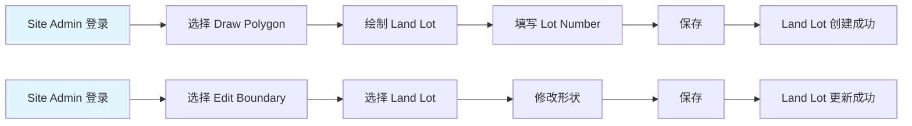
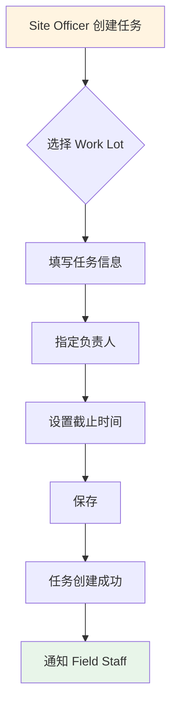
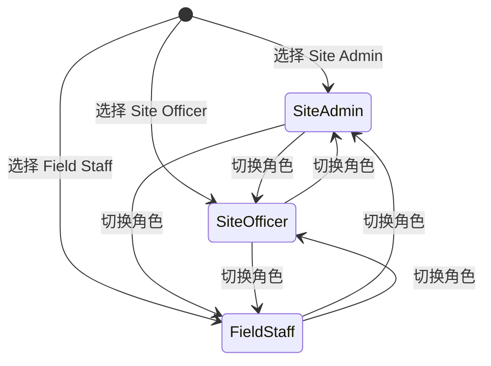

# 角色与权限

## 1. 角色定义

LLMS 系统定义了三种核心角色，分别对应不同的业务职责和操作权限。

### 1.1 Site Admin（系统管理员/测量/IT）

**业务定位**：
- 负责维护 Land Lot（法律地界）数据
- 管理系统配置和用户权限
- 通常由测量人员或 IT 人员担任

**关注点**：
- Land Lot 边界的准确性
- 系统数据的完整性
- 用户和权限管理

**典型场景**：
- 根据 Soft Copy Plans 绘制 Land Lot 边界
- 更新测量队提供的精确坐标
- 添加新的地块区域（如南面地段）
- 管理用户账号和角色分配

### 1.2 Site Officer（现场主任/前线管理）

**业务定位**：
- 负责维护 Work Lot（实际占用范围）数据
- 创建和分配任务
- 追踪收地和交地进度

**关注点**：
- Work Lot 与实际 Operator 的对应关系
- 任务执行进度和逾期风险
- 收地状态和困难个案

**典型场景**：
- 根据现场情况绘制 Work Lot 边界
- 为 Work Lot 创建任务并分配给现场人员
- 查看全局进度和逾期预警
- 导出报表给管理层

### 1.3 Field Staff（现场人员/执行人员）

**业务定位**：
- 执行分配的任务
- 在现场核验位置和收集信息
- 更新任务状态

**关注点**：
- 分配给自己的任务列表
- 任务的地块位置和要求
- 任务完成情况

**典型场景**：
- 查看今日任务列表
- 到达现场后通过 GPS 核验位置
- 查看 Work Lot 的 Operator 信息
- 完成任务后更新状态和备注

## 2. 权限矩阵

### 2.1 功能权限总览

| 功能模块 | Site Admin | Site Officer | Field Staff |
|----------|------------|--------------|-------------|
| **登录/退出** | ✅ | ✅ | ✅ |
| **地图查看** | ✅ | ✅ | ✅ |
| **底图切换** | ✅ | ✅ | ✅ |
| **图层开关** | ✅ | ✅ | ✅（只读） |
| **搜索定位** | ✅ | ✅ | ✅ |
| **Land Lot 查看** | ✅ | ✅ | ✅ |
| **Land Lot 绘制** | ✅ | ❌ | ❌ |
| **Land Lot 编辑** | ✅ | ❌ | ❌ |
| **Land Lot 删除** | ✅ | ❌ | ❌ |
| **Work Lot 查看** | ✅ | ✅ | ✅ |
| **Work Lot 绘制** | ❌ | ✅ | ❌ |
| **Work Lot 编辑** | ❌ | ✅ | ❌ |
| **Work Lot 删除** | ❌ | ✅ | ❌ |
| **Snapping（吸附）** | ❌ | ✅（对 Land Lot） | ❌ |
| **任务创建** | ✅ | ✅ | ❌ |
| **任务分配** | ✅ | ✅ | ❌ |
| **任务查看** | ✅（全部） | ✅（全部） | ✅（仅自己） |
| **任务状态更新** | ✅ | ✅ | ✅（仅自己） |
| **任务删除** | ✅ | ✅ | ❌ |
| **报表查询** | ✅ | ✅ | ✅（只读） |
| **数据导出** | ✅ | ✅ | ❌ |
| **用户管理** | ✅ | ❌ | ❌ |
| **系统配置** | ✅ | ❌ | ❌ |

### 2.2 地图工具权限

| 工具 | Site Admin | Site Officer | Field Staff |
|------|------------|--------------|-------------|
| 🖐 Pan（平移） | ✅ | ✅ | ✅ |
| 🔍 Search（搜索） | ✅ | ✅ | ✅ |
| ⬠ Draw Polygon | ✅（Land Lot） | ✅（Work Lot） | ❌ |
| ✏️ Edit Boundary | ✅（Land Lot） | ✅（Work Lot） | ❌ |
| 🗑 Delete | ✅（Land Lot） | ✅（Work Lot） | ❌ |
| 📍 Select/Click | ✅ | ✅ | ✅ |
| 🔲 Box Select | ✅ | ✅ | ✅ |
| 🧲 Snapping | ❌ | ✅（自动启用） | ❌ |

### 2.3 数据访问权限

| 数据类型 | Site Admin | Site Officer | Field Staff |
|----------|------------|--------------|-------------|
| **Land Lot** | 读写 | 只读 | 只读 |
| **Work Lot** | 只读（灰化） | 读写 | 只读 |
| **Task（全部）** | 读写 | 读写 | 只读 |
| **Task（自己）** | 读写 | 读写 | 读写 |
| **User** | 读写 | 只读 | 只读（仅自己） |
| **System Config** | 读写 | 只读 | 只读 |

## 3. 权限规则详解

### 3.1 图层编辑规则

#### Site Admin 编辑 Land Lot



**规则**：
- Site Admin 可以绘制、编辑、删除 Land Lot
- Work Lot 图层对 Site Admin 只读且灰化（opacity 降低）
- 不可选择或编辑 Work Lot

#### Site Officer 编辑 Work Lot


**规则**：
- Site Officer 可以绘制、编辑、删除 Work Lot
- Land Lot 图层对 Site Officer 只读但可见（用于参考）
- 绘制 Work Lot 时自动启用 Snapping（吸附到 Land Lot 边界）
- 不可编辑 Land Lot

#### Field Staff 只读模式

**规则**：
- Field Staff 不可绘制、编辑、删除任何图层
- 可以点击 Work Lot 查看详情
- 可以查看 Land Lot 作为参考

### 3.2 任务权限规则

#### 任务创建与分配



**规则**：
- Site Admin 和 Site Officer 可以创建任务
- 任务必须关联到一个 Work Lot
- 可以指定任何 Field Staff 作为负责人
- Field Staff 不可创建任务

#### 任务状态更新

| 角色 | 可更新的任务 | 可更新的状态 |
|------|--------------|--------------|
| Site Admin | 全部任务 | 全部状态 |
| Site Officer | 全部任务 | 全部状态 |
| Field Staff | 仅自己负责的任务 | 进行中、已完成 |

**规则**：
- Field Staff 只能看到和更新分配给自己的任务
- Field Staff 不能删除任务
- 任务逾期状态由系统自动计算（当前时间 > 截止时间）

### 3.3 报表与导出权限

| 功能 | Site Admin | Site Officer | Field Staff |
|------|------------|--------------|-------------|
| 查看全部 Work Lot 列表 | ✅ | ✅ | ✅（只读） |
| 查看全部 Land Lot 列表 | ✅ | ✅ | ✅（只读） |
| 地图框选查询 | ✅ | ✅ | ✅ |
| 导出 Work Lot CSV | ✅ | ✅ | ❌ |
| 导出 Land Lot CSV | ✅ | ✅ | ❌ |
| 查看任务统计 | ✅ | ✅ | ✅（仅自己） |

## 4. 权限实现机制

### 4.1 前端权限控制

#### UI 级权限（按钮可见/可用）

```typescript
// 示例：权限计算
const canDrawLandLot = computed(() => role.value === 'SITE_ADMIN')
const canDrawWorkLot = computed(() => role.value === 'SITE_OFFICER')
const canModifyLandLot = computed(() => role.value === 'SITE_ADMIN')
const canModifyWorkLot = computed(() => role.value === 'SITE_OFFICER')
const canDeleteLandLot = computed(() => role.value === 'SITE_ADMIN')
const canDeleteWorkLot = computed(() => role.value === 'SITE_OFFICER')
const canAccessAdmin = computed(() => role.value === 'SITE_ADMIN')
const canExport = computed(() => ['SITE_ADMIN', 'SITE_OFFICER'].includes(role.value))
```

**MapToolbar 只渲染允许的按钮**：
- Site Admin：Pan / Draw Land Lot / Edit Land Lot / Delete Land Lot
- Site Officer：Pan / Draw Work Lot / Edit Work Lot / Delete Work Lot
- Field Staff：Pan / Select

#### 行为级权限（双保险）

即使按钮隐藏，也要在 action 执行前再检查一次：

```typescript
// 示例：行为级权限检查
function modifyWorkLot(workLotId: string) {
  if (!permission.canModifyWorkLot) {
    console.warn('Permission denied: cannot modify Work Lot')
    return
  }
  // 执行修改逻辑
}
```

### 4.2 图层可见性控制

| 角色 | Land Lot Layer | Work Lot Layer |
|------|----------------|----------------|
| Site Admin | 可见、可编辑 | 可见、只读、灰化 |
| Site Officer | 可见、只读 | 可见、可编辑 |
| Field Staff | 可见、只读 | 可见、只读 |

**灰化效果**：
- Site Admin 看到的 Work Lot 图层 opacity 降低（例如 0.3）
- 不可选择、不可编辑

### 4.3 Snapping 规则

**仅 Site Officer 在画 Work Lot 时启用 snapping**：
- Snapping target：Land Lot layer 的边界
- Snapping tolerance：可配置（例如 10 像素）
- 视觉反馈：鼠标靠近 Land Lot 边界时显示吸附提示

**重要**：Snap interaction 要最后 add，确保 pointermove 事件处理顺序正确。

## 5. 角色切换（演示用）

### 5.1 切换机制

**页面右上角：Switch Role 下拉菜单**



### 5.2 切换效果

**切换角色后立即生效**：
- 工具栏按钮更新（显示/隐藏）
- 图层可编辑性更新（可编辑/只读/灰化）
- 任务列表过滤（全部/仅自己）
- 导出按钮显示/隐藏

### 5.3 验收标准

- ✅ 切换角色后，工具栏可用按钮与可编辑图层立即变化
- ✅ Admin 能画/改/删 Land Lot；Officer 能画/改/删 Work Lot；Field Staff 全只读
- ✅ Officer 画 Work Lot 时对 Land Lot 边界有明显吸附效果（snapping 生效）

## 6. 移动端权限

### 6.1 移动端角色

**移动端主要面向 Field Staff**：
- 查看任务列表（仅自己）
- 查看 Work Lot 信息
- GPS 核验位置
- 更新任务状态

**Site Officer 也可使用移动端**：
- 查看全部任务
- 查看全部 Work Lot
- 更新任务状态
- 不支持绘制和编辑（移动端不提供绘图工具）

### 6.2 移动端权限矩阵

| 功能 | Site Officer（移动端） | Field Staff（移动端） |
|------|------------------------|----------------------|
| 查看任务列表 | ✅（全部） | ✅（仅自己） |
| 查看任务详情 | ✅ | ✅（仅自己） |
| 更新任务状态 | ✅ | ✅（仅自己） |
| 查看 Work Lot | ✅ | ✅ |
| GPS 核验 | ✅ | ✅ |
| 绘制/编辑 | ❌ | ❌ |

## 7. 权限异常处理

### 7.1 权限不足提示

**场景**：用户尝试执行无权限的操作

**处理**：
- 显示友好的提示信息："您没有权限执行此操作"
- 不显示错误堆栈或技术细节
- 提供联系管理员的方式

### 7.2 数据访问限制

**场景**：Field Staff 尝试访问其他人的任务

**处理**：
- 后端（未来）：返回 403 Forbidden
- 前端（当前）：过滤数据，只显示自己的任务

### 7.3 会话过期

**场景**：用户长时间未操作，会话过期

**处理**：
- 显示"会话已过期，请重新登录"
- 跳转到登录页
- 保存当前页面路径，登录后自动跳转回来

## 8. 安全考虑

### 8.1 前端权限的局限性

**当前阶段（Demo）**：
- 权限控制仅在前端实现
- 数据存储在 localStorage（Pinia + persistedstate）
- 角色切换无需认证

**风险**：
- 用户可以通过浏览器开发工具修改角色
- 数据可以被直接访问和修改

**对策**：
- 明确标注为 Demo/Prototype
- 不存储敏感数据
- 未来版本实现真实的后端认证和授权

### 8.2 未来增强（Phase 2）

**真实的认证与授权**：
- JWT Token 认证
- 后端 API 权限验证
- 审计日志（记录所有操作）
- 会话管理（超时、单点登录）

**数据安全**：
- 数据库权限控制
- 敏感数据加密
- API 访问限流
- HTTPS 强制

## 9. 参考文档

- [术语表](../附录/术语表.md)
- [用户故事与验收](../需求分析/用户故事与验收.md)
- [Web端设计](../技术方案/Web端设计.md)
