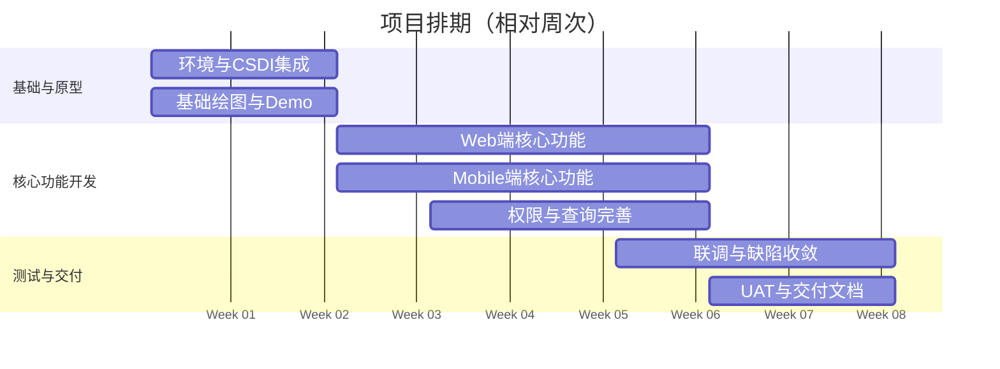

# 里程碑与交付物

## 文档定位
- 本文档用于统一项目里程碑、交付物与验收口径，并提供可视化时间线与排期表。
- 功能范围与边界请参考《目标与范围》。
- 非功能指标与约束请参考《非功能与约束》。

## 1. 可视化排期（甘特图）

> Week 1 为项目启动周（相对周次）；甘特图使用基准日期仅用于生成周序与间隔显示。

## 2. 排期与交付物清单

| 阶段 | 周次 | 主要交付物 | 验收标准 |
| --- | --- | --- | --- |
| 基础与原型 | Week 1-2 | 开发环境搭建完成 CSDI Topographic Map API 集成成功 HK80 坐标系注册和 TileGrid 配置 基础绘图功能（Draw Polygon） 可视化 Demo（预置 demo polygons） | 底图正常显示，署名信息完整 可绘制多边形并保存 刷新页面数据不丢失 |
| 核心功能开发 | Week 3-6 | Web 端完整功能（地图、图层、Work Lot、任务、报表） Mobile 端基础功能（任务列表、GPS、地块查看） 角色权限控制 搜索与查询功能 | 所有用户故事验收通过 角色权限正确生效 移动端可正常使用 |
| 测试与交付 | Week 6-8 | UAT 测试完成 文档完整（用户手册、技术文档） 培训材料 部署到 C1 Site Server | UAT 通过率 ≥ 90% 文档完整且可读 用户培训后可独立操作 |

> Week 6 为开发收尾与测试启动重叠周，用于联调与缺陷收敛。

## 3. 关键依赖（摘要）
- Soft Copy Plans、示例数据、服务器访问权限需按时提供。
- 详细依赖与约束请参考《非功能与约束》。
