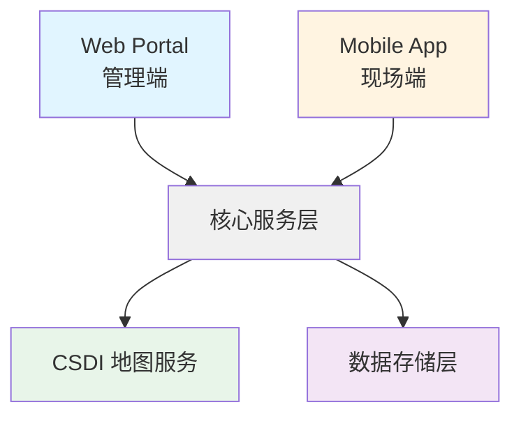

# 项目介绍

## 1. 项目背景

### 1.1 业务痛点

在土地收回与移交管理过程中，多方协作（CEDD、LandsD、承建商、现场团队）需要频繁核对大量数据：

- **地块边界复杂**：法律地界（Land Lot）与实际占用范围（Operator）往往不一致
- **数据分散**：地块信息、BU/住户数据、收地状态、任务进度分散在多个文档和系统中
- **人工核对易错**：判断某个 BU/Household 属于哪个地块时容易出现误判
- **现场协同低效**：现场人员缺乏实时的地图工具和任务信息

### 1.2 项目契机

- 香港政府 CSDI（Common Spatial Data Infrastructure）提供权威的官方地理数据和底图服务
- ND/2025/01 项目（San Tin Technopole Phase 1 Stage 1 (East) - Contract 2）需要高效的地块管理工具
- 现有工具（如 EPCS）功能分散，缺乏统一的地图视图和任务管理能力

## 2. 文档定位与阅读指引

- 本文档用于介绍项目背景、系统定位与核心组成，帮助快速理解 LLMS 是什么。
- 目标、范围与验收请以《目标与范围》为准。
- 需求细节与验收请以《需求分析/用户故事与验收》为准。
- 数据结构与接口请分别参考《数据结构》《接口文档》。
- 里程碑与交付物请参考《里程碑与交付物》；约束、风险与变更管理请参考《目标与范围》《非功能与约束》。

## 3. 系统概述

### 3.1 系统定位

LLMS（Land Lot Management System）是一套**集中式 Web 管理看板 + 现场人员移动端 App** 的地块/作业管理系统，以 **CSDI 官方地图为底座**，统一地块、任务、人员与进度管理。

### 3.2 核心组成

**Web Portal（管理端）**：
- 交互式地图（CSDI 底图 + 图层管理）
- Work Lot 绘制与编辑
- 任务模块（创建、分配、追踪）
- 报表与查询（列表、地图框选、导出）
- 用户与权限管理

**Mobile App（现场端）**：
- 地图与导航（CSDI 底图）
- 任务列表与详情
- GPS 核验与地块信息
- 任务状态更新

### 3.3 技术特点

- **权威数据源**：直接集成 CSDI Topographic Map API 和 Map Label API
- **统一坐标系**：全系统使用 HK80（EPSG:2326）坐标系
- **GIS 驱动**：基于 OpenLayers 的地图引擎，支持多边形绘制、编辑、吸附等功能
- **前端优先**：Vue 3 + Pinia 实现快速原型和演示能力

## 4. 项目团队

### 4.1 开发团队（isBIM）

- **项目经理**：Eric Xiao
- **项目协调**：Khalil Chiu 、Patricia Ren
- **项目开发**：K.D 林文伟
- **BIM 团队负责人**：Rex Lau

### 4.2 客户团队（CEDD）

- **项目负责人**：Victor Suen
- **项目协调**：Cherry Suen

### 4.3 相关方

- **地政总署（LandsD）**：Keith Pang, W.H. Leung
- **顾问团队（ABJV）**：Victor Go (CRE), Humphrey Wu (SRE), Hon
- **IT 支持（Kuly）**：Tony Lo

## 5. 参考文档

- [Kick-off Meeting Minutes](../附录/会议纪要/kick-off.md)
- [术语表](../附录/术语表.md)
- [合同摘要](../附录/合同摘要.md)
