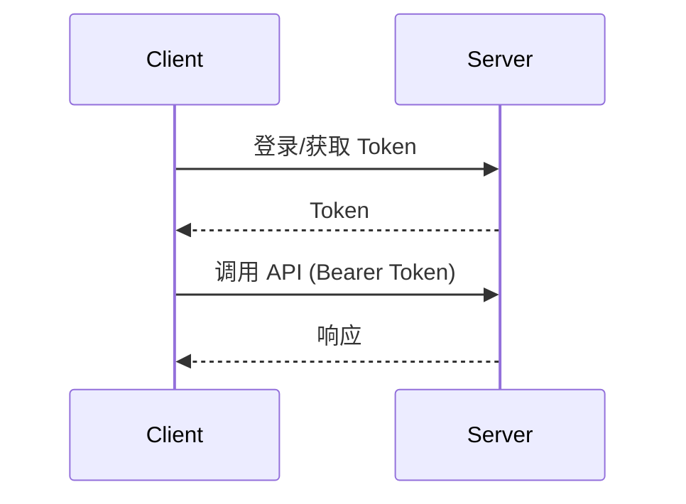

# 接口总览与规范

## 1. 基本信息
- Base URL：`TODO`
- 版本：`v1`

## 2. 认证方式
- 认证类型：Bearer Token
- 获取方式：`TODO`

## 3. 通用响应结构
```json
{
  "traceId": "string",
  "code": 200,
  "success": true,
  "msg": "Success.",
  "detail": null,
  "data": {}
}
```

## 4. 错误码
| HTTP | code | 含义 | 说明 |
| --- | --- | --- | --- |
| 400 | 400 | Bad Request | 参数校验失败 |
| 401 | 401 | Unauthorized | 未认证或 Token 过期 |
| 403 | 403 | Forbidden | 无权限 |
| 404 | 404 | Not Found | 资源不存在 |
| 409 | 409 | Conflict | 状态冲突 |
| 500 | 500 | Server Error | 服务器异常 |

## 5. API 清单（与用户故事映射）
> TODO: 补充接口清单（模块 / 方法 / 路径 / 说明 / 关联 US）。

## 6. 认证流程（时序图）

